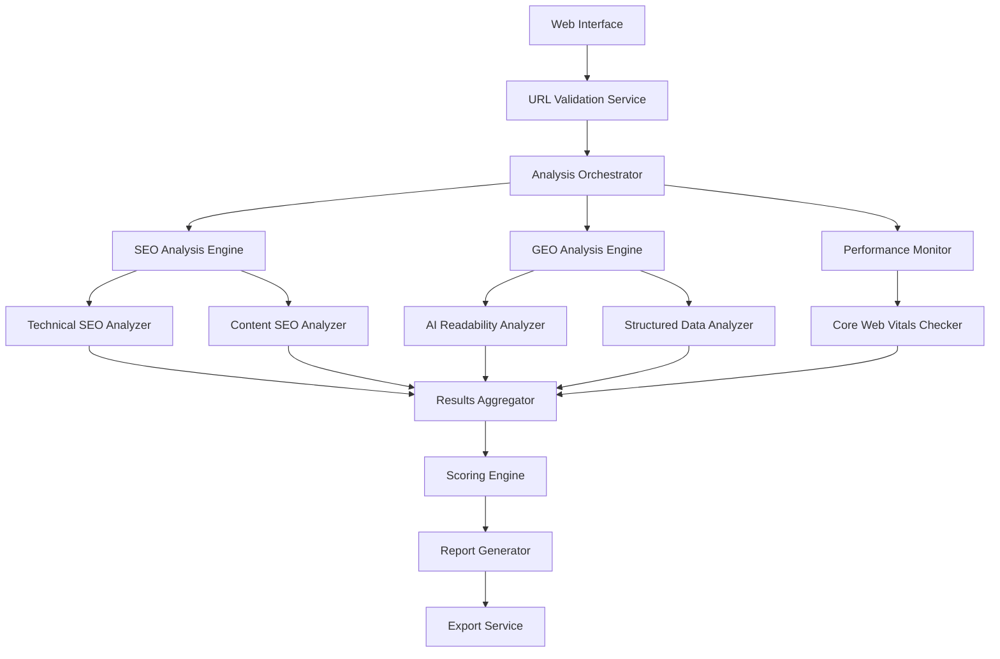

# SEO & GEO Health Checker Design Document

## Overview

The SEO & GEO Health Checker is a comprehensive web application that analyzes websites for both traditional Search Engine Optimization (SEO) and Generative Engine Optimization (GEO) factors. The tool provides detailed scoring, actionable recommendations, and exportable reports to help website owners optimize their content for both traditional search engines and AI-powered systems.

## Architecture

### High-Level Architecture



### Technology Stack

- **Frontend**: React with TypeScript for type safety and modern UI components
- **Backend**: Node.js with Express for API services
- **Analysis Libraries**: 
  - Puppeteer for web scraping and performance analysis
  - Cheerio for HTML parsing and content analysis
  - Lighthouse for performance and SEO auditing
- **External APIs**:
  - Google PageSpeed Insights API for Core Web Vitals
  - Schema.org validator for structured data
  - Custom content analysis algorithms for GEO factors

## Components and Interfaces

### 1. URL Input and Validation Component

**Purpose**: Handle user input and validate URLs belong to the same domain

**Interface**:
```typescript
interface URLValidationService {
  validateURLs(urls: string[]): ValidationResult;
  normalizeDomain(url: string): string;
  checkDomainConsistency(urls: string[]): boolean;
}

interface ValidationResult {
  valid: boolean;
  normalizedUrls: string[];
  errors: ValidationError[];
}
```

### 2. SEO Analysis Engine

**Purpose**: Perform comprehensive traditional SEO analysis

**Components**:
- **Technical SEO Analyzer**: Page speed, mobile responsiveness, crawlability
- **Content SEO Analyzer**: Meta tags, headers, keyword optimization
- **Structure Analyzer**: Internal links, URL structure, sitemap

**Interface**:
```typescript
interface SEOAnalysisEngine {
  analyzeTechnicalSEO(url: string): Promise<TechnicalSEOResult>;
  analyzeContentSEO(url: string): Promise<ContentSEOResult>;
  analyzeStructure(url: string): Promise<StructureResult>;
}
```

### 3. GEO Analysis Engine

**Purpose**: Analyze content for AI and generative engine optimization

**Components**:
- **AI Readability Analyzer**: Content clarity, structure, Q&A format
- **Credibility Analyzer**: Author info, citations, expertise signals
- **Completeness Analyzer**: Topic coverage, information gaps

**Interface**:
```typescript
interface GEOAnalysisEngine {
  analyzeAIReadability(content: string): Promise<ReadabilityResult>;
  analyzeCredibility(url: string): Promise<CredibilityResult>;
  analyzeCompleteness(content: string, topic: string): Promise<CompletenessResult>;
}
```

### 4. Scoring Engine

**Purpose**: Calculate weighted scores and generate recommendations

**Interface**:
```typescript
interface ScoringEngine {
  calculateOverallScore(results: AnalysisResults): number;
  generateRecommendations(results: AnalysisResults): Recommendation[];
  prioritizeRecommendations(recommendations: Recommendation[]): Recommendation[];
}
```

## Data Models

### Analysis Results Model

```typescript
interface AnalysisResults {
  url: string;
  timestamp: Date;
  overallScore: number;
  seoScore: SEOScore;
  geoScore: GEOScore;
  recommendations: Recommendation[];
  technicalDetails: TechnicalDetails;
}

interface SEOScore {
  overall: number;
  technical: number;
  content: number;
  structure: number;
  details: {
    pageSpeed: number;
    mobileResponsive: boolean;
    titleTag: QualityScore;
    metaDescription: QualityScore;
    headingStructure: QualityScore;
    internalLinks: number;
  };
}

interface GEOScore {
  overall: number;
  readability: number;
  credibility: number;
  completeness: number;
  structuredData: number;
  details: {
    contentClarity: QualityScore;
    questionAnswerFormat: boolean;
    authorInformation: boolean;
    citations: number;
    schemaMarkup: string[];
  };
}

interface Recommendation {
  id: string;
  category: 'SEO' | 'GEO' | 'Technical';
  priority: 'High' | 'Medium' | 'Low';
  impact: number;
  effort: 'Easy' | 'Medium' | 'Hard';
  title: string;
  description: string;
  actionSteps: string[];
  example?: string;
}
```

### Configuration Model

```typescript
interface AnalysisConfig {
  seoWeights: {
    technical: number;
    content: number;
    structure: number;
  };
  geoWeights: {
    readability: number;
    credibility: number;
    completeness: number;
    structuredData: number;
  };
  thresholds: {
    pageSpeedMin: number;
    contentLengthMin: number;
    headingLevels: number;
  };
}
```

## Error Handling

### Error Categories

1. **Network Errors**: Unreachable URLs, timeouts, DNS failures
2. **Parsing Errors**: Invalid HTML, missing content, blocked resources
3. **API Errors**: Rate limits, service unavailability, authentication issues
4. **Validation Errors**: Invalid URLs, cross-domain requests, malformed input

### Error Handling Strategy

```typescript
interface ErrorHandler {
  handleNetworkError(error: NetworkError): PartialResults;
  handleParsingError(error: ParsingError): PartialResults;
  handleAPIError(error: APIError): PartialResults;
  retryWithBackoff(operation: () => Promise<any>, maxRetries: number): Promise<any>;
}
```

### Graceful Degradation

- Continue analysis with available data when some checks fail
- Provide partial scores with clear indicators of missing data
- Offer alternative analysis methods when primary tools fail
- Cache successful results to avoid re-analysis on retry

## Testing Strategy

### Unit Testing

- **URL Validation**: Test domain consistency, URL normalization, error cases
- **Analysis Engines**: Mock external APIs, test scoring algorithms
- **Scoring Logic**: Verify weight calculations, recommendation generation
- **Error Handling**: Test all error scenarios and recovery mechanisms

### Integration Testing

- **End-to-End Workflows**: Complete analysis from URL input to report generation
- **API Integration**: Test external service integration with real and mock data
- **Performance Testing**: Analyze tool performance with multiple URLs
- **Cross-Browser Testing**: Ensure compatibility across different browsers

### Test Data Strategy

```typescript
interface TestScenarios {
  perfectSEOSite: string; // High-scoring reference site
  poorSEOSite: string;    // Low-scoring reference site
  mixedContentSite: string; // Varied quality content
  technicalIssuesSite: string; // Site with technical problems
  geoOptimizedSite: string; // AI-optimized content example
}
```

### Performance Benchmarks

- Analysis completion time: < 30 seconds per URL
- Memory usage: < 500MB for 10 concurrent analyses
- API rate limit compliance: Respect all external service limits
- Error recovery time: < 5 seconds for retry operations

## Security Considerations

### Input Validation

- Sanitize all URL inputs to prevent injection attacks
- Validate domain restrictions to prevent unauthorized scanning
- Implement rate limiting to prevent abuse
- Use HTTPS for all external API communications

### Data Privacy

- Do not store analyzed website content permanently
- Anonymize URLs in logs and error reports
- Provide clear data retention policies
- Allow users to delete analysis history

### External Service Security

- Use API keys securely with environment variables
- Implement proper authentication for external services
- Monitor for suspicious activity and rate limit violations
- Maintain audit logs for all external API calls

## Deployment and Scalability

### Deployment Architecture

- Containerized application using Docker
- Horizontal scaling capability for analysis workers
- Load balancing for multiple concurrent analyses
- Caching layer for frequently analyzed domains

### Monitoring and Observability

- Application performance monitoring
- External API health checks
- Error rate tracking and alerting
- User analytics and usage patterns

### Configuration Management

- Environment-specific configuration files
- Feature flags for experimental analysis methods
- Configurable scoring weights and thresholds
- API key rotation and management